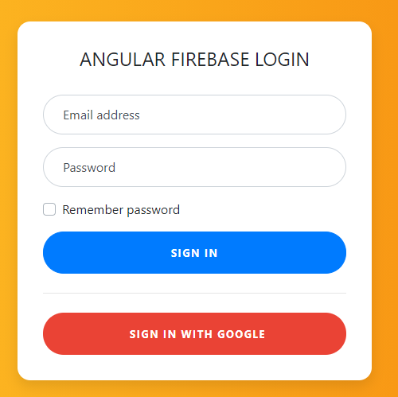
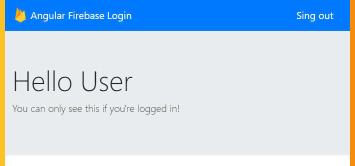

# Angular Firebase Login

An Angular project just to test the Firebase Authentication/Hosting

## Itens used in this project

- Angular 10.1.6
- Node 14.13.1
- Firebase Auth
- Firebase hosting
- GitHub Workflows/Actions

## Live site

https://angular-firebase-login.moraisandre.com/ (or [here](https://angular-firebase-login-b521e.web.app/))

## Screenshots

Login Page

Dashboard Page
